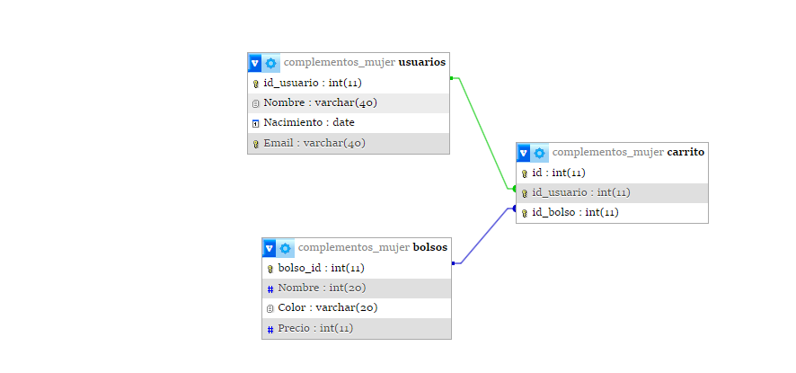

--Venta de Bolsos--
Este proyecto consiste en el diseño de una base de datos para una tienda en línea. La base de datos está diseñada
para almacenar información sobre usuarios, bolsos y lo que los usuarios deseen comprar guardados en una tabla diferente para mejorar la gestion de ventas y de inventario. 

Estructura de Base de Datos:

-Bolsos:
    -id_bolso: Contiene el identificador unico del producto. 
    -Nombre: Contiene el nombre del producto.
    -Color: Color a elegir por el usuario.
    -Precio: Precio del producto.

-Carrito:
    -id: El identificador para el grupo de usuario y bolsos.
    -id_usuario: Para identificar el carrito del usuario.
    -id_bolso: Para identificar los bolsos que se vayan a elegir.

-Usuarios:
    -Id_usuario: Identidicador unico para el nuevo usuario.
    -Nombre: Nombre de usuario de la persona que ingrese a la plataforma.
    -Nacimiento: Para poder identificar la edad del usuario.
    -Email: Correo electronico para enviar futuras propagandas al usuario.

Diadrama de datos:

A continuación se muestra el diagrama de la base de datos que ilustra las relaciones entre las tablas.

--PARTE 2--
--!!IMPORTANTE!!--
Yo Andrea Anchordoquy tengo problemas con el dispositivo o con el editor, no se me guardan los ultimos cambios en vscode y
no los puedo recuperar a tiempo para la entrega.
-- 
En esta parte logramos insertar "bolsos" desde la pagina web a la base de datos, ingresando obligatoriamentre un color 
para poder separarlos en "categorias por color". 
Los botones de "borrar" fueron implementados con exito y los de "ver" fueron implementados con algunos errores(no se incluye el css).
La parte de iniciar sesion no fue posible de implementarla por falta de tiempo y experiencia.
En un futuro vamos a implementarlo(si es posible en la entrega de la parte 3).